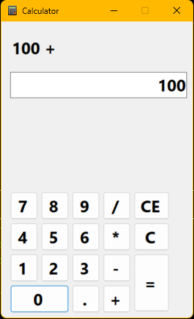

# 🧮✨ Net8CalcApp — .NET 8 Calculator  🚀

[](https://github.com/Achintha-999/Net8CalcApp) [](https://docs.microsoft.com/dotnet/csharp/)  
[](https://www.microsoft.com/windows)  
[](https://dotnet.microsoft.com/)  
[](https://github.com/Achintha-999/Net8CalcApp/issues)

✨ A simple and intuitive calculator application built with C# and Windows Forms, targeting .NET 8.0. This project demonstrates basic arithmetic operations and a user-friendly interface for learning and practical use.

---

Contents
- 🧾 About
- 🎯 Features
- 📐 Design & UI
- ⚙️ How it works
- 🧩 Requirements
- 🚀 Installation & Quick Start
- 🧭 Usage
- 🧪 Testing & Quality
- 🤝 Contributing
- 📅 Roadmap
- 📝 License
- 🙏 Acknowledgements

---

About 🧾
--------
Net8CalcApp is an educational Windows Forms calculator built with .NET 8 and C#. Clean, compact, and easy to read — great for learning desktop UI and application logic.

Features ✅
---------
- 🔢 Basic arithmetic: Add, Subtract, Multiply, Divide
- 🔁 Chaining operations (left-to-right)
- 🔸 Decimal support
- 🧹 AC (All Clear) and C (Clear entry)
- ⌫ Backspace / delete last digit
- ⌨️ Keyboard input support (numbers, + - * /, Enter, Backspace)
- 🎨 Simple, modern WinForms UI with accessibility in mind

Screenshots / Demo 📸
---------------------

  


Design & UI 🎨
-------------
Visual goals:
- High contrast display for numbers and results 🔦
- Large, tappable buttons for mouse or touch 🖱️🖐️
- Clear operator coloring for fast recognition 🎯

Suggested layout:
- Display row (result + smaller history)
- Button grid:
  - Row 1: AC | C | ⌫ | ÷
  - Row 2: 7 | 8 | 9 | ×
  - Row 3: 4 | 5 | 6 | −
  - Row 4: 1 | 2 | 3 | +
  - Row 5: ± | 0 | . | =

Pro tip: Use decimal type for calculation logic to reduce floating-point surprises 🧮

How it works — high-level ⚙️
---------------------------
Event-driven WinForms app using a small CalculatorEngine (separate class) for logic. The UI sends user input to the engine; the engine maintains state and returns formatted text for the display.

Flow:
1. User enters digits → UI appends to current input
2. Operator selected → engine stores previous value & operator
3. User enters next number and presses = → engine computes result & returns display string
4. Special operations (AC, C, ←) update engine/UI accordingly

Core components:
- Program.cs — application entry point 🏁
- MainForm.cs — UI and event handlers 🖥️
- CalculatorEngine.cs — pure arithmetic & state (unit-testable) 🧩
- assets/ — icons, screenshots, optional themes 🎨

Example logic (simplified)
```csharp
public class CalculatorEngine {
    private decimal? storedValue = null;
    private string pendingOp = null;
    private string input = "0";

    public void EnterDigit(char d) { /* append safely */ }
    public void EnterDecimalPoint() { /* only once */ }
    public void SetOperator(string op) { /* compute or queue */ }
    public string Evaluate() { /* compute final result */ }
    private decimal Compute(decimal a, decimal b, string op) { /* + - * / */ }
}
```

Requirements 🧩
--------------
- OS: Windows (WinForms)
- .NET SDK: .NET 8.0 (https://dotnet.microsoft.com/download/dotnet/8.0)
- IDE: Visual Studio (recommended) / Rider / VS Code (no visual WinForms designer)
- Hardware: Any modern Windows-capable PC

Installation & Quick Start 🚀
---------------------------
Clone:
```bash
git clone https://github.com/Achintha-999/Net8CalcApp.git
cd Net8CalcApp
```

Open & run:
- Visual Studio: Open solution or .csproj → F5
- dotnet CLI:
  ```bash
  dotnet build
  dotnet run --framework net8.0
  ```
Note: WinForms requires UseWindowsForms in the project file and Windows OS.

Usage 🧭
------
- 0–9: digits
- . : decimal point
- + − × ÷ : operators
- = or Enter : evaluate
- AC : all clear
- C : clear current entry
- ← or Backspace : delete last digit
- Escape : (optional) AC

Accessibility tip: ensure button tab order and provide keyboard shortcuts for the basic controls ♿

Testing & Quality 🧪
-------------------
- Unit-test the CalculatorEngine (recommended frameworks: xUnit / MSTest / NUnit)
  - Basic math: 2+2=4, 6/3=2 ✅
  - Decimal checks: 0.1+0.2 (use decimal) 🔎
  - Divide-by-zero handling (show "Error" or similar) ⚠️
- UI smoke tests:
  - Keyboard input, clicking, edge cases

Contributing 🤝
--------------
Contributions welcome! Please:
1. Fork the repo 🍴
2. Create a feature branch (feature/…) 🌿
3. Open a PR with a clear description ✍️

When filing issues include:
- Steps to reproduce
- Expected vs actual behavior
- Screenshot / logs
- OS / .NET SDK version

Roadmap / TODO 📅
-----------------
- [ ] Unit tests for CalculatorEngine 🧪
- [ ] Memory functions (M+, M-, MR, MC) 🧠
- [ ] History log for previous calculations 🕘
- [ ] Dark theme & improved styling 🌙
- [ ] Accessibility improvements ♿

License 📝
---------
No LICENSE file is present yet. Suggested: MIT. Add a LICENSE file to publish terms.

MIT License (example — create LICENSE file)
```
MIT License
Copyright (c) YEAR Achintha-999
Permission is hereby granted, free of charge...
```

Acknowledgements 🙏
------------------
- Built with .NET & Windows Forms
- Inspired by common mobile/desktop calculators
- Thanks to anyone who tests, files issues, or contributes 🎉

Contact 📬
---------
Project owner: Achintha-999 — https://github.com/Achintha-999

---

